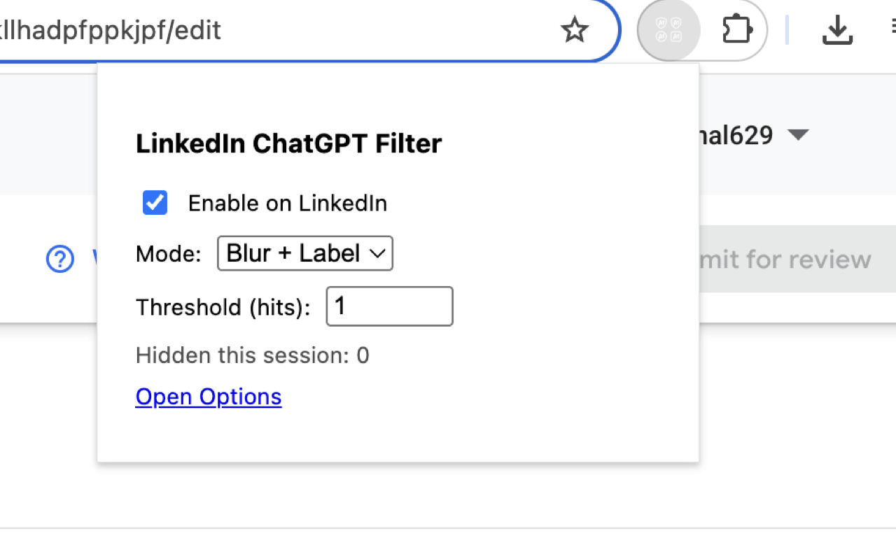
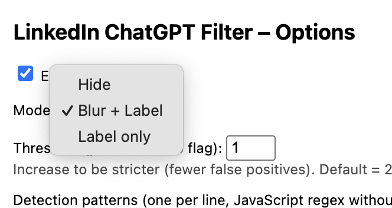

# LinkedIn Distraction Filter

A lightweight Chrome Extension that helps you stay focused on LinkedIn by **blurring and labeling distracting posts** such as motivational spam, generic career tips, or other low-value content.  
You can customize what gets filtered using keywords and scoring rules.

---

## ✨ Features
- 🔍 Automatically detects distracting posts on LinkedIn feeds.  
- 🛡️ Blurs and labels filtered posts so you can focus on real content.  
- ⚙️ Simple **Options Page** to customize keywords and thresholds.  
- 📊 Lightweight, fast, and privacy-friendly (no data leaves your browser).  

---

## 📥 Installation

### Option 1 — Manual Install (Developer Mode)
1. Download this repository as a `.zip` and unzip it.  
2. Open Chrome and go to `chrome://extensions/`.  
3. Enable **Developer Mode** (top right).  
4. Click **Load unpacked**.  
5. Select the folder containing the extension (`manifest.json` should be inside).  
6. Refresh LinkedIn and enjoy distraction-free browsing 🚀.

### Option 2 — Chrome Web Store (coming soon)
We’ve submitted the extension for review. Once it’s approved, you’ll be able to install it directly from the Chrome Web Store with one click.

---

## ⚙️ Permissions
- **storage** → used to save your custom keywords and settings locally.  
- **host permissions** (`https://www.linkedin.com/*`) → required so the extension can read and filter posts on LinkedIn pages.  
✅ No remote code, no external servers, your data never leaves your machine.  

---

## 🖼️ Screenshots

  
   
  
   
  <em>Blurred & labeled distraction posts in LinkedIn feed</em>

---

## 💡 Contributing
Have an idea to improve filtering rules or add new features? Open an issue or PR!  

---

## 📣 Share & Feedback
If you like this, please share it with your network and let me know your feedback.  
Follow me on LinkedIn for updates and new projects!  

---
